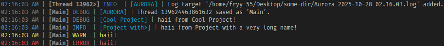
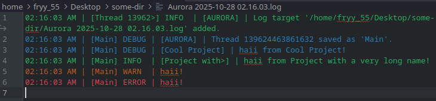

# Aurora

A simple C++23 logger library, inspired by [Geode](https://github.com/geode-sdk/geode)'s logging system.

```c++
#include <aurora/aurora.hpp>


int main() {
	using namespace aurora;

	log::set12hTimeEnabled(true);
	log::setFileLogLevel(log::LogLevel::Debug);

	TargetManager::get()->logToDir(
		std::format("{}/Desktop/some-dir", std::getenv("HOME")),
		"Aurora"
	);

	ThreadManager::get()->addThread("Main");

	log::debug("[Cool Project] haii from Cool Project!");
	log::info("[Project with a very long name] haii from Project with a very long name!");
	log::warn("haii!");
	log::error("haii!");

	return 0;
}
```


> [!NOTE]
> File logs may not be colored depending on your text editor!

# Features
- `aurora::log`
	- ANSI supported logging to 4 different levels (`aurora::log::debug`, `aurora::log::info`, `aurora::log::warn`, `aurora::log::error`)
	- Custom log source specification (e.g. `aurora::log::debug("[AURORA] Hello from Aurora!")` -> `...] DEBUG | [AURORA] | Hello from Aurora!`)
	- An ability to configure some of the logging aspects
- `aurora::ThreadManager`
	- An ability to add names to threads for better readability in logs
- `aurora::TargetManager` **(NOTE: on some systems Aurora's file access failure reasons may not be accurate!)**
	- Custom log targets (files)
	- Automatic per-directory log management

# Usage
## Installing
Install [CPM](https://github.com/cpm-cmake/CPM.cmake) if you don't have it in your project and add the following lines to your `CMakeLists.txt`:

```cmake
CPMAddPackage("gh:Fryy55/aurora@1.0.0")
target_link_libraries(${PROJECT_NAME} aurora)
```
Replace `1.0.0` with the version you want to use.

> [!TIP]
> Normally, every class is located in the `aurora::*` namespace, however, if you are fine with leaking Aurora to every TU, you can add `set(AURORA_USE_NAMESPACE TRUE)` to your `CMakeLists.txt`. This will precompile the header that solely uses the namespace, thus enabling you to use features directly without explicitly using the namespace everywhere.

You can also use a specific tag/branch/commit of amber like this:

`CPMAddPackage("gh:Fryy55/amber#b492c63")` - tag/branch/commit hash

## Using
Simply include headers (e.g. `#include <aurora/log.hpp>`) and use them in your projects!

There is also a general "include everything" header (`<aurora/aurora.hpp>`), as well as grouped headers (e.g. `<aurora/singletons/singletons.hpp>`).

# License
This project is distributed under the **MIT License**.

See `LICENSE` for permissions, conditions and limitations.